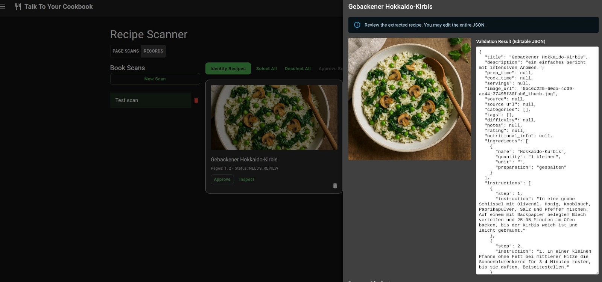
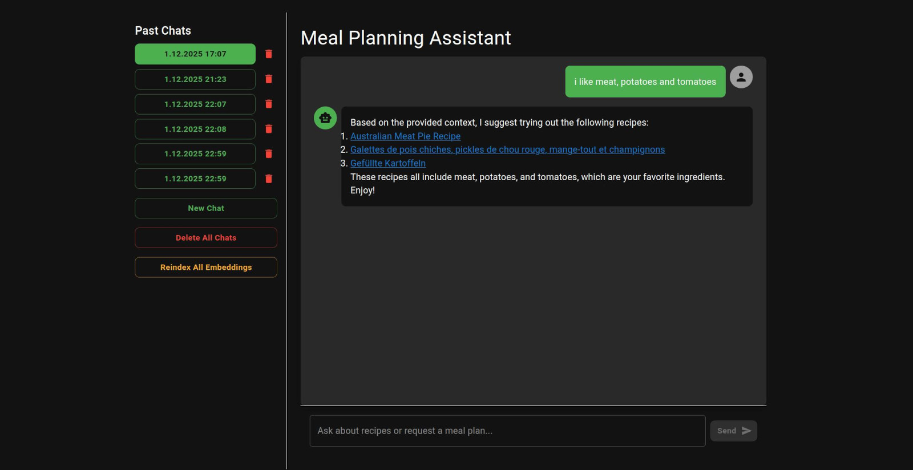
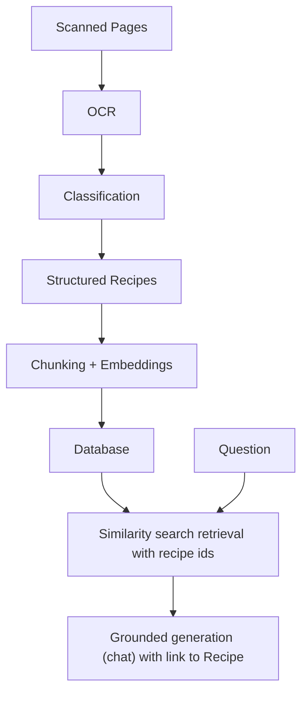

# Talk To Your Cookbook


## Why? AI Architecture Pattern Demonstrator

This project shows how to integrate modern AI workflows into legacy products and use cases.

A reoccurring question in existing software companies. How can AI be used to deliver better results?

The most generic answer: automate the data ingest and simplify data retrieval from your system.

This demonstrator shows how this can be done with OCR & RAG.






## Goal: AI-Assisted Recipe Management Demonstrator

Recipe management software has existed since a long time.

This demonstrator adds three intelligent capabilities:

1) OCR pipeline to extract structured data from recipe images  
2) Semantic recipe retrieval using embeddings
3) Grounded chat interaction with user data

The CRUD UI exists to provide realistic context for these AI features.


## Architecture



FastAPI orchestrates workers, persistent embeddings, and chat behavior.

More documentation in: https://dolind.github.io/talk-to-your-cookbook

## Usage
Currently, this application can be run locally for demonstration.

Usage details:
→ **Usage Guide**: docs/usage.md  


### Install

```bash
git clone https://github.com/dolind/talk-to-your-cookbook.git

cd talk-to-your-cookbook

make install

make docker
```

Some features might modification of environment file, which must be copied from `.env.example` to `.env.dev` or `.env.prod`.

### Run Backend

```bash
make docker
make api-dev
```

### Frontend (optional demo UI)

```bash
make dev
```

and follow screen instructions

## LLM/RAG Evaluation (in progress)

Planned focus areas:
- Retrieval effectiveness
- LLM Model accuracy
- Latency & scaling observations for different models
