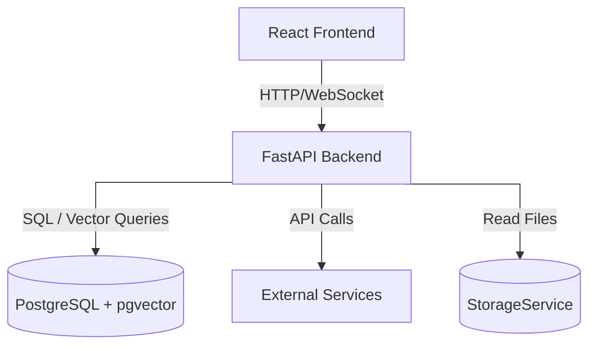

## Overall
The overall architecture of the system

```mermaid
%%{ init: { 'flowchart': { 'curve': 'stepAfter' } } }%%
flowchart TD

%% High-level components
frontend[React Frontend]
backend[FastAPI Backend]
postgres[(PostgreSQL + pgvector)]
storage[(StorageService)]
external[External Services]

%% Main connections
frontend -->|HTTP/WebSocket| backend
backend -->|SQL / Vector Queries| postgres
backend -->|API Calls| external
backend -->|Read Files| storage

```