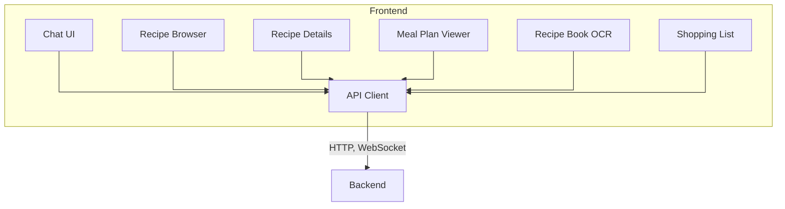
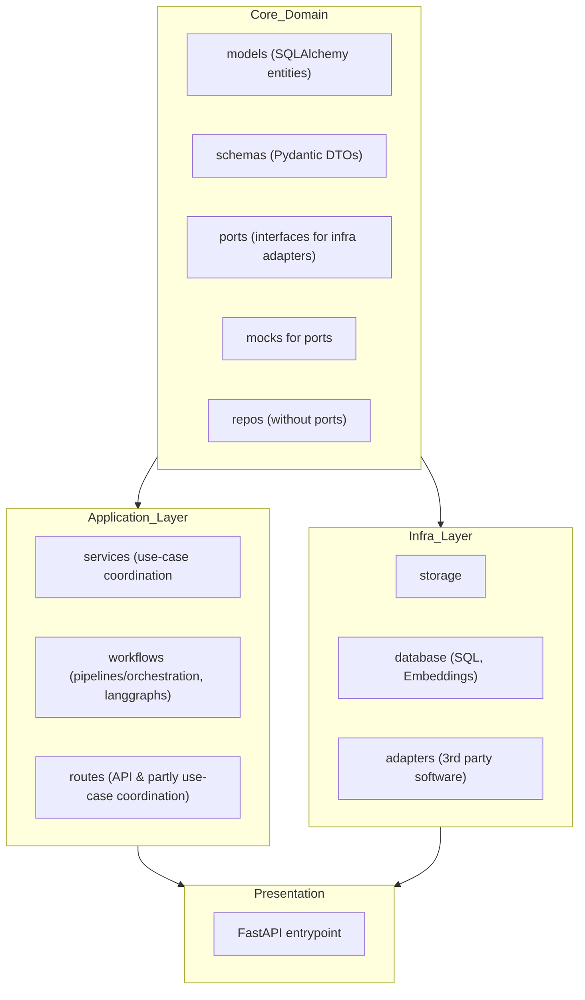

## Frontend

The frontend provides interfaces to interact with intelligent workflows
(OCR ingestion, retrieval search, grounded
chat). State remains primary in the backend to simplify demo usage.

## Backend

I try to follow a clean architecture approach and at the same time balance this with the speed requirement of a
prototyping phase.

This has led to only a soft clean architecture structure.

The standard structure of fastapi apps makes it difficult to follow a clean architecture.

I did try to follow a more structure approach. However, doing so creates a lot of extra files, and therefore I settled
on
this slimmer structure

Components are grouped by their role in the stack; edges are omitted for clarity.

