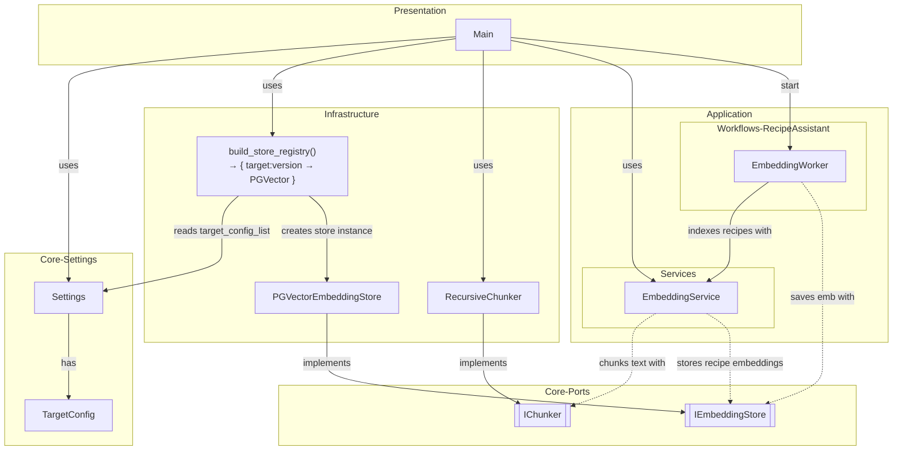

The following pipeline presents how the embeddings are created.
The embedding worker is an example for one of the background workers.
This allows smooth operation of the frontend, while the backend is busy creating the embeddings.

