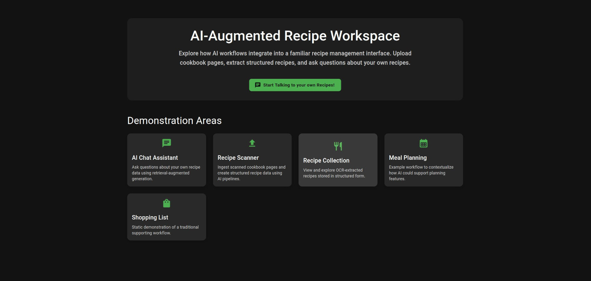

# Talk To Your Cookbook Living Documentation

This project shows how to integrate modern AI workflows into legacy use-cases.

**Case Study**: Recipe management software  

Legacy domain challenges:

- Unstructured and structured data
- Multi-modal inputs (text + scanned images)
- Complex organization workflows
- Historically manual operations

This demonstrator adds three intelligent capabilities:

1. OCR pipeline to extract structured data from recipe images  
2. Semantic recipe retrieval using embeddings
3. Grounded chat interaction with user data

The CRUD UI exists to provide realistic context for these AI features.
