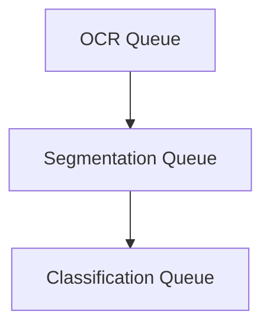

## Basic architecture

The OCR subsystem ingests scanned cookbook pages and extracts structured recipe data that powers retrieval and chat.

Segmentation and classification operate asynchronously using **three background queues** to maintain responsiveness 
and handle multi-page workflows.


There are two primary reasons for this design:

First, Latency tolerance:

- OCR often relies on external APIs or GPU processing. 
- Queues prevent UI blocking and allow batching.

Second, many recipes span multiple pages.
Systems that process each page in isolation:

- struggle to correctly assemble multi-page content

- require manual fixes or hacks (e.g., duplicated pages in queue)

- misidentify leftover or partial ingredients


The ocr segmentation workflow is:

1. Perform OCR on all text pages

2. Segment each page into recipe fragments

3. Reassemble fragments into complete recipes during classification

Segmentation identifies where recipe boundaries are.
Classification validates and groups fragments across pages into a single structured recipe.


This structured output becomes the basis for:

- semantic search
- context-aware chat interactions
- future nutritional and personalization features

Advanced multi-column and multi-image segmentation exists privately for commercialization

## Graphs and Langchain workflows
The workflow uses `langgraph` as backend technology.
Currently, both workflows are simple, but allow extension for more complex behavior.

### Segmentation
```mermaid
{!diagrams/graphs/segmentation.mmd !}
```

Segmentation currently is a linear workflow. 

1. We detect segments of multiple recipes (pro-version only)
2. The user can manually correct/add segments.
3. Final Approval of the segments stores them in the database.

This is done for every page, which is recognized as a text page.


### Classification
```mermaid
{!diagrams/graphs/classification.mmd !}
```

Classification is already more complex and includes the repeated revisiting of a node.

Pages are collected in groups. First this is checked, then we aggregate all text pages and use the image page as thumbnail.

The user needs to validate the extracted recipe text.

We then add categories to the recipe (currently only in pro-version).
The user checks/adds his categories.
Input is verified and then finally stored in the database as recipe.