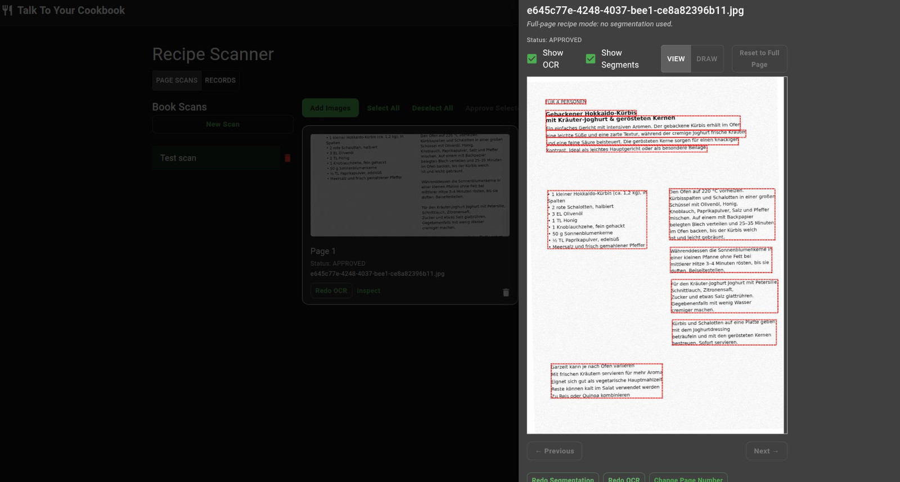
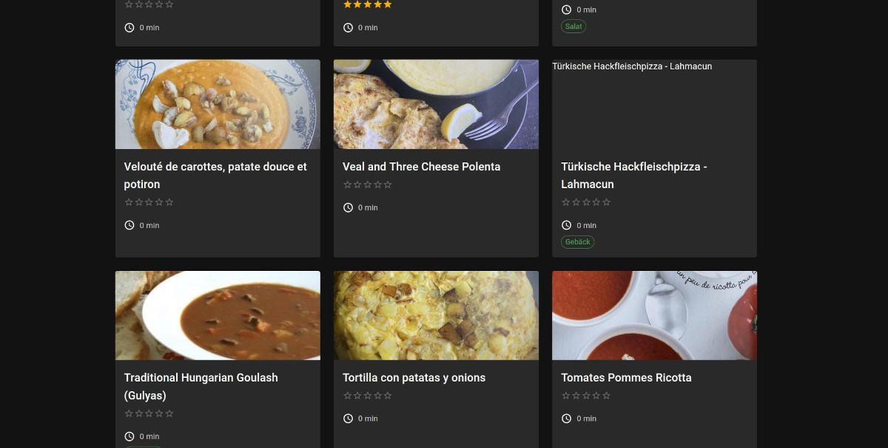
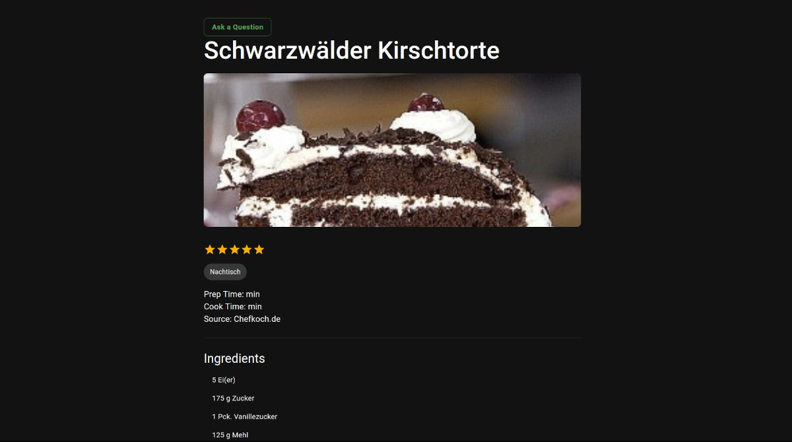
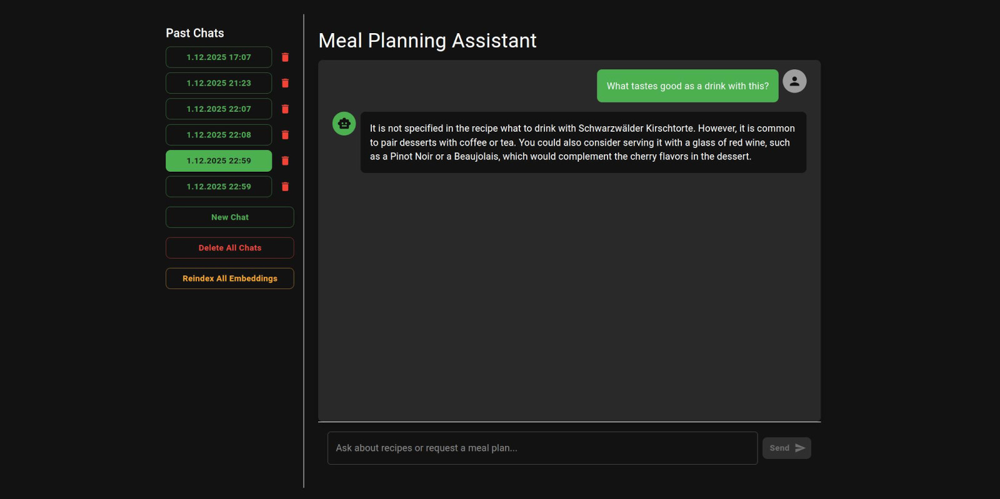
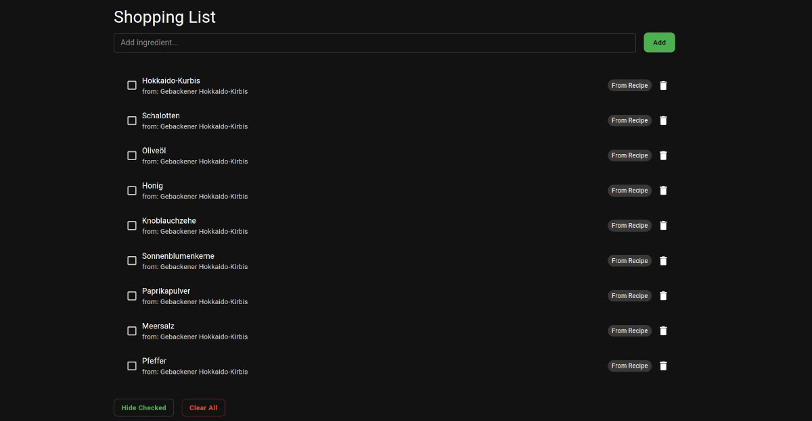
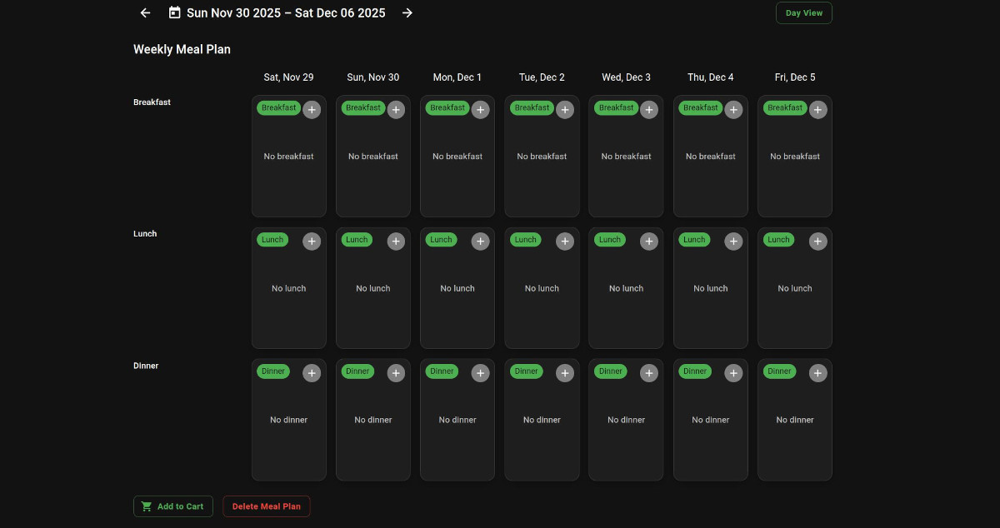

# Usage Guide

This guide demonstrates the AI workflows integrated into the legacy recipe manager UI.

## 1) Upload & Extract (Recipe Scanner)
### Part 1: Detect Recipes
1. Open the **Recipe Scanner** screen, **Page Scans**
2. Drop a scanned cookbook page
3. Approve or adjust detected text regions (optional)

This part uses a predefined OCR backend (Google, Tesseract in free version, Paddle in paid) to get the text.

Pro Version only: The workflow then proceeds to Segment the page into different Recipes.

### Part 2: Classify Recipe Sections and label Recipe with LLM

1. Open the **Recipe Scanner** screen, **Records**
2. Click **Identify Recipes**
3. The workflow will group different recipes together, use an LLM to classify and finally assign labels to the recipe.

→ Newly created recipes appear in the browser and become searchable.

## 2) Browse Recipes

The standard recipe browser screen.

- Browse
- Add/Edit/Delete your recipes
- Classic Search

## 3) Ask Questions About a Recipe

Click on a recipe to get to the recipe detail page:
- Click **Ask a Question**
- The chat opens with recipe context auto-loaded

Example questions:

- “Is this vegetarian?”
- “Suggest a side dish.”
- “How long does this take to prepare?”

→ Retrieved chunks from your own data reduce hallucinations.

## 4) Ask for Similar Recipes (Global Chat)

Use the chat entry via sidebar or top menu:
- Ask for recipes by ingredient, preference, or dish type

Examples:

- “Show me more pasta dishes”
- “Anything without dairy?”
- “What can I cook with chickpeas?”

→ Uses pgvector similarity search over recipe embeddings.

## 5) Optional Legacy Workflows

These screens remain mostly static for now:

- Meal planner
- Shopping list

They are in the app for completeness.
In the future an extension of AI capabilities to shopping list and meal plan is planned.

